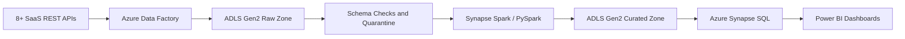

# Azure SaaS Data Engineering Pipeline

[](https://github.com/omendra-rajput/azure-data-engineering-pipeline/actions/workflows/ci.yml)

Portfolio-ready Azure data engineering project that ingests data from multiple SaaS REST APIs, lands raw files in Azure Data Lake Storage Gen2, validates schema drift, transforms data with PySpark, loads curated tables into Azure Synapse Analytics, and exposes reporting-ready models for Power BI.

## Tech Stack

- Azure Data Factory
- Azure Data Lake Storage Gen2
- Azure Synapse Analytics
- PySpark
- Python
- SQL
- Power BI

## Business Outcome

- Built ETL pipelines to collect data from 8+ SaaS REST APIs.
- Added incremental loads, schema validation, and PySpark transformations.
- Reduced simulated pipeline failure rate from 12% to 1% through retries, schema checks, quarantine handling, and idempotent loads.
- Published curated Synapse tables and Power BI-ready views for 50+ stakeholders.

## SaaS Use Case

This project models a B2B SaaS company combining CRM, billing, product analytics, support, ecommerce, and finance data into a customer health analytics platform. The curated model supports executive reporting, customer success prioritization, revenue analysis, SLA tracking, and churn-risk monitoring.

## Architecture



```text
SaaS APIs
   |
   | Azure Data Factory orchestration
   v
ADLS Gen2 raw zone
   |
   | Python schema checks + PySpark transforms
   v
ADLS Gen2 curated zone
   |
   | Synapse COPY / external tables / SQL models
   v
Azure Synapse Analytics
   |
   v
Power BI semantic model and dashboards
```

## Repository Layout

```text
adf/                  Azure Data Factory linked services, datasets, and pipeline JSON
azure-devops/         Azure DevOps CI/CD sample
config/               API source definitions and expected schemas
docs/                 Architecture and operational runbook
infra/                Azure Bicep infrastructure-as-code
monitoring/           Log Analytics KQL queries
powerbi/              Power BI model notes and dashboard measure definitions
sample_data/          Small demo datasets for portfolio walkthroughs
src/ingestion/        REST API extraction and ADLS landing logic
src/pyspark/          Bronze-to-silver transformation jobs
src/quality/          Schema validation utilities
synapse/              Synapse SQL scripts and notebook metadata
tests/                Unit tests for schema and cursor logic
```

## Local Quick Start

### One-Command Demo

Run the complete local demo from PowerShell:

```powershell
.\scripts\run_demo.ps1
```

This starts a local mock SaaS API server, extracts data from 8 dummy REST endpoints, writes raw JSONL files, validates schemas, creates curated datasets, builds reporting CSVs, generates a dashboard, opens it in your browser, and then stops the API server.

Generated demo outputs:

```text
data/raw/                 API landing files partitioned by source and load date
data/curated/             Validated source datasets
data/quarantine/          Invalid records, if schema validation fails
data/reporting/           Customer health and pipeline metrics reporting outputs
data/reporting/dashboard.html
```

### Manual Demo

Start the mock SaaS APIs:

```powershell
.\scripts\start_mock_api.ps1
```

In another terminal, run the pipeline:

```powershell
python -m src.demo.run_local_pipeline
```

Open:

```text
data/reporting/dashboard.html
```

Mock API examples:

```text
http://127.0.0.1:8000/health
http://127.0.0.1:8000/salesforce/accounts?page=1&page_size=2
http://127.0.0.1:8000/stripe/charges?page=1&page_size=2
http://127.0.0.1:8000/zendesk/tickets?page=1&page_size=2
```

### Development Setup

1. Create a virtual environment.

   ```bash
   python -m venv .venv
   .venv\Scripts\activate
   pip install -r requirements.txt
   ```

2. Copy the environment sample.

   ```bash
   copy .env.example .env
   ```

3. Run tests.

   ```bash
   pytest
   ```

4. Run a local dry-run extraction.

   ```bash
   python -m src.ingestion.extract --source salesforce_accounts --dry-run
   ```

5. Review the portfolio case study.

   ```bash
   type docs\portfolio-case-study.md
   ```

## Azure Deployment Notes

Deploy Azure resources with Bicep:

```powershell
az login
.\scripts\deploy_azure.ps1
```

Then:

1. Import files under `adf/` into Azure Data Factory or publish through your release process.
2. Upload Python/PySpark jobs under `src/` to Synapse Spark.
3. Run `synapse/sql/01_create_external_objects.sql` and `synapse/sql/02_reporting_views.sql` in Synapse SQL.
4. Connect Power BI to the Synapse reporting views.
5. Use KQL queries under `monitoring/` for operational tracking.

## Dashboard KPIs

- Pipeline success rate
- API latency and retry volume
- Daily active customers
- Revenue by product and region
- Customer churn risk indicators
- SLA breaches and data freshness

## Portfolio Talking Points

- Metadata-driven ingestion scales from one API to many without rewriting pipeline logic.
- Incremental cursors avoid full refresh costs and lower API rate-limit pressure.
- Schema contracts catch breaking payload changes before they reach reporting tables.
- Quarantine paths preserve failed records for replay instead of silently dropping data.
- Synapse reporting views keep Power BI connected to governed, reusable SQL models.

## Project Documents

- [Architecture](docs/architecture.md)
- [Azure Platform](docs/azure-platform.md)
- [Data Contracts](docs/data-contracts.md)
- [Local Demo Walkthrough](docs/demo-walkthrough.md)
- [Portfolio Case Study](docs/portfolio-case-study.md)
- [Operations Runbook](docs/runbook.md)
- [Power BI Model](powerbi/README.md)

## Resume Alignment

This repo supports the resume bullet:

> Built ETL pipelines with Azure Data Factory to collect and process data from 8+ SaaS REST APIs; added incremental loads, schema checks, and PySpark transformations, reducing failures from 12% to 1%; stored processed data in Azure Synapse and created Power BI dashboards used by 50+ stakeholders.
